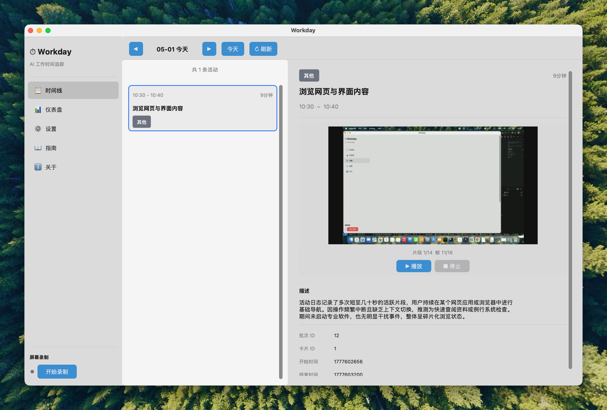

# Workday



AI 驱动的工作时间追踪工具。自动以 1 FPS 录制屏幕，通过两阶段 LLM 分析生成每日活动时间线。

参考 [Dayflow](https://github.com/dayflow-ai/dayflow) 设计，Python 跨平台实现，桌面 GUI 基于 CustomTkinter。

## 安装

**从 PyPI 安装（推荐）**

```bash
# 使用 uv（推荐）
uv tool install workday-py --prerelease allow

# 或使用 pip
pip install workday-py --pre
```

安装后直接运行：

```bash
workday
```

**从源码运行**

环境要求：Python >= 3.12，[uv](https://docs.astral.sh/uv/)

```bash
git clone https://github.com/8DE4732A/workday.git
cd workday
uv sync
uv run workday
```

启动后在「设置」页面填写 API Base URL、API Key 和模型 ID。支持任何兼容 OpenAI API 的服务（OpenAI、火山引擎 ARK、本地 Ollama 等）。

## 使用方法

```bash
uv run workday           # 启动桌面 GUI
uv run workday --version # 查看版本
```

启动 GUI 后：

1. 点击左下角「开始录制」开始屏幕录制
2. 录制数据自动提交后台 AI 分析
3. 在「时间线」视图查看生成的活动卡片
4. 在「仪表盘」查看 Token 用量统计
5. 在「设置」修改录制和分析参数

## 工作原理

```
屏幕截图 (1 FPS)
    │ 每 15 秒打包为视频片段
    ▼
Stage 1 LLM：视频 → 3-5 条观察记录
    ▼
Stage 2 LLM：观察记录 → 活动卡片（15-60 分钟/张）
    ▼
时间线（工作 / 学习 / 娱乐 / 其他）
```

## 数据存储

所有数据本地保存，不上传云端（仅调用 LLM API 时传输屏幕内容）：

```
workday.db      # SQLite 数据库（配置 + 活动数据）
recordings/     # 屏幕录制视频片段
logs/           # 运行日志
```

## 开发

```bash
uv sync --all-extras   # 安装开发依赖
uv run pytest          # 运行测试
uv run ruff check src/ # Lint
uv run ruff format src/ # 格式化
```

## 许可证

MIT
